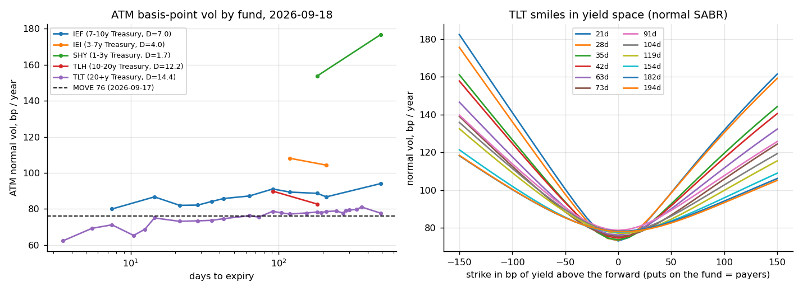
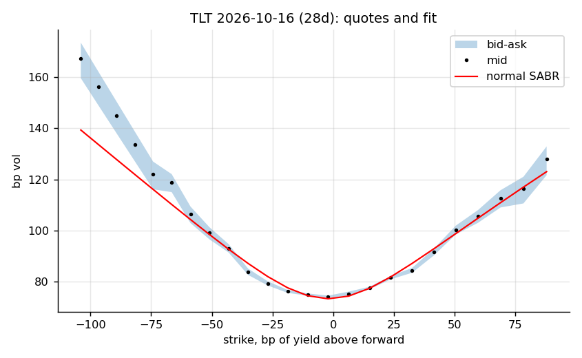
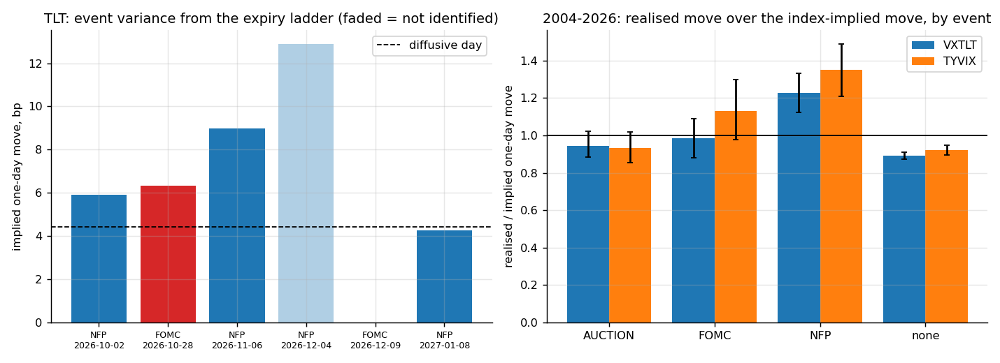
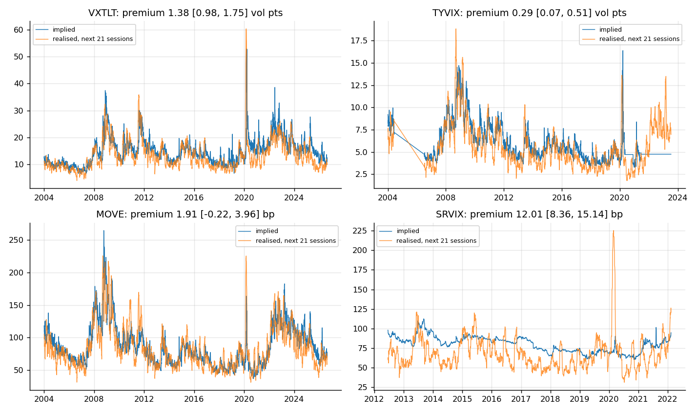
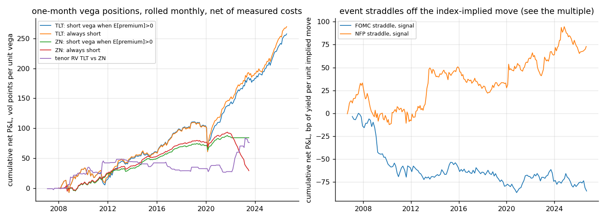
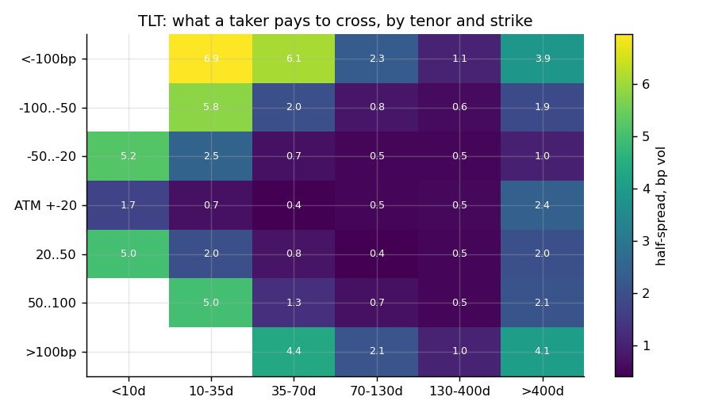
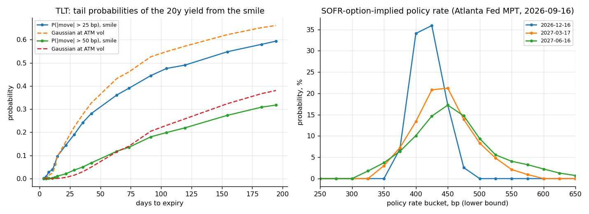
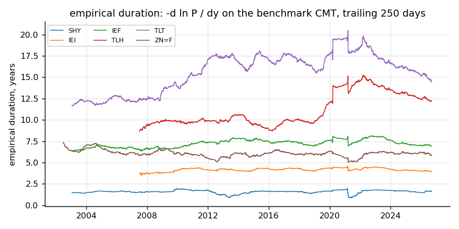

# rates-vol-cube — the basis-point vol cube, event variance, and the taking side of rates volatility

**Question.** A rates vol desk quotes in basis-point (normal) vol by expiry and tenor, prices a scheduled release separately from a diffusive day, and takes positions in the gap between implied and realised. Can that toolkit be built and tested on free data — and which of the standard relative-value trades in rates vol survive the cost of taking, measured rather than assumed?

**Answer (§Results).** The cube and the event extraction work on the listed Treasury-ETF chains; the premium is real and in the ordinary days; two of the four trades survive costs and one of them only because of the signal; the event trade is the trap.
- *Cube.* On 2026-09-18 the TLT chain (26 expiries, 853 two-sided quotes) gives a one-month ATM normal vol of **73.5 bp** against MOVE 76.2; IEF 82.7, SHY 154 (two expiries, 13 quotes — the front end is thin). Normal SABR per expiry: median error 4.7 bp vol, the fit inside the market on 38 % of TLT quotes (the penny-wide wings are 10 bp vol wide). Empirical durations from a rolling regression on the CMT curve agree with the sponsors' stated numbers (TLT 14.4 vs 15.0, IEF 7.0 vs 6.9, SHY 1.7 vs 1.8).
- *Events.* The expiry ladder prices the 28 Oct FOMC at 6.3 bp and the payroll releases at 5.9–9.0 bp of implied one-day move on the 20y, against a 4.4 bp diffusive day — an event day is **1.75× (FOMC) / 1.67× (NFP)** a normal day. Over 2004–2026 the realised move over the *index*-implied move (VXTLT/√252) is 0.89 [0.87, 0.91] on ordinary days, 0.99 [0.88, 1.09] on FOMC days and **1.23 [1.12, 1.33] on payroll days**; the 10y future (TYVIX, 2004–2023) says the same: 0.92, 1.13, 1.35.
- *Premium.* Implied minus next-21-session realised: **+1.4 vol points [1.0, 1.8] on TLT** (8.6 bp), +0.3 [0.1, 0.5] on the 10y future, +1.9 bp [−0.2, 4.0] for MOVE against the 10y CMT, +12 bp [8, 15] for 1y10y swaptions (SRVIX). Adding implied vol to a HAR-RV forecast raises the out-of-sample R² of realised vol from 0.34 to 0.43 (TLT), 0.35 to 0.44 (10y future), 0.42 to 0.57 (MOVE); the swaption index forecasts nothing at one month.
- *Trades, net of measured costs.* Short one-month vega on TLT, rolled monthly, costs 0.26 vol points per unit vega round trip (ATM half-spread 0.09 vol points, hedging 0.08) and makes **+1.15 vol points per month [0.56, 1.68], Sharpe 0.87** — with a 49-point drawdown in March 2020 and no help from the HAR+IV signal (always-short: +1.21). On the 10y future the signal is the trade: +0.45 [0.26, 0.67], Sharpe 1.10, against +0.16 [−0.19, 0.52] always-short. Tenor RV (TLT vs ZN bp-vol ratio, |z| > 1) mean-reverts (slope −0.037 per unit z, CI excludes zero) but nets +0.39 [−0.00, 0.87]. The FOMC straddle priced off the index is flat (always-short −0.04 [−0.70, 0.55] bp per event); the payroll straddle priced off the index looks like a buy (+0.77 [0.23, 1.34]) — and priced at the ladder's 1.67× multiple it is a sell (−2.5 [−3.1, −1.9]). The index cannot tell you what the event straddle costs; the ladder can, and the sign flips.

Data checked 18 September 2026. Python package `ratesvol` (numpy/scipy/pandas/DuckDB), a recorder for the chains, 23 tests, CI runs the whole pipeline on the checked-in reference data and a sample chain.

---

## Layout

```
tools/download.py      Yahoo daily bars (TLT IEF SHY IEI TLH AGG HYG LQD TBT SPY, ZN/ZF/ZB futures, VIX MOVE), Cboe index histories
                       (VXTLT 2004-, TYVIX 2003-2023, SRVIX 2012-2022), the Treasury par curve 2002-, FOMC meeting dates 2004-,
                       TreasuryDirect note/bond auctions, the Atlanta Fed Market Probability Tracker, iShares stated durations
tools/record.py        the chain recorder: Cboe delayed-quote API, every listed option of each fund (bid, ask, sizes, IV, Greeks,
                       OI, volume) -> data/raw/cboe/<SYM>/<time>.json.gz; --loop through the session; --archive keeps the closing
                       chain of each day in data/chains/ (tracked)
ratesvol/pricing.py    Black (1976) and Bachelier prices, Greeks, safeguarded-Newton implied vols; Hagan's lognormal-to-normal
                       conversion; the bp conversions (price vol -> yield vol through duration, strike -> bp of yield)
ratesvol/duration.py   empirical duration: rolling regression of the fund's return on its benchmark CMT yield change
ratesvol/cube.py       per expiry: forward and discount factor from put-call parity, OTM quotes in yield space, normal SABR
                       (beta = 0) fit, ATM bp vol / skew / fly, fit report; the taking-cost table by tenor and strike bucket
ratesvol/events.py     event variance from the expiry ladder (NNLS on total variance, identification flag); the 22-year
                       implied-vs-realised event study on VXTLT and TYVIX; the Atlanta Fed distribution as the STIR input
ratesvol/vrp.py        realised variance (close, Parkinson, Garman-Klass, Yang-Zhang), the premium per index with block-
                       bootstrap intervals, HAR-RV with and without implied, walk-forward
ratesvol/rv.py         the cost model (option half-spread + hedge turnover), the P&L engine (vega x (realised - implied)),
                       the four strategies with baselines and cost sensitivity
ratesvol/density.py    Breeden-Litzenberger from the SABR slice, tail probabilities in bp of yield; the SOFR-implied
                       policy distribution and its accuracy
ratesvol/data.py       loaders, the event calendar (FOMC, NFP by the BLS rule, 10y/30y auctions), chain parsing, DuckDB views
ratesvol/run.py, cli   the pipeline and the command line: python -m ratesvol run|cube|events|vrp|density|sql
tests/                 23 tests (below);  scripts/  run_all.sh, plots.py, summarize.py, report.py, make_notebook.py
data/reference/        the downloaded tables (4 MB);  data/chains/ closing chains;  data/sample/chains/ the CI sample
results/               run.json, summary.md, figures/;  report.pdf;  notebooks/results.ipynb
```

Install: `pip install -e .[test]`; `python -m pytest`; `scripts/run_all.sh` (download → record → run → figures → summary → report → notebook). The recorder should run daily — `python tools/record.py --loop 1800` from a scheduler — because the chain history is the one input that cannot be downloaded later.

---

## Data

| layer | source | span | notes |
|---|---|---|---|
| option chains | Cboe delayed quotes, recorded by `tools/record.py` | from 2026-09-18 | every listed option on TLT, IEF, SHY, IEI, TLH, AGG, HYG, LQD, TBT, SPY; 15-minute delay; the 16:00 snapshot is the closing chain |
| implied vol histories | Cboe: VXTLT (TLT, 30-day), TYVIX (10y note futures, 30-day), SRVIX (1y10y USD swaptions) | 2004–, 2003–2023, 2012–2022 | daily closes; TYVIX and SRVIX are discontinued but their histories are published |
| MOVE | ICE BofA, via Yahoo | 2002– | one-month normal vol of 2y/5y/10y/30y Treasury options, bp |
| underlyings | Yahoo daily OHLC: the funds, ZN/ZF/ZB continuous futures, VIX | 2002– | realised vol and empirical durations |
| curve | Treasury daily par yields | 2002– | benchmark tenors for the durations, the funding rate, realised bp vol for MOVE and SRVIX |
| events | Fed FOMC calendars (scheduled statement days; unscheduled flagged), BLS rule for payrolls, TreasuryDirect 10y/30y auctions | 2004– | 191 scheduled FOMC, ~12 NFP a year, ~140 each of 10y and 30y auctions since 2015 |
| STIR-implied policy path | Atlanta Fed Market Probability Tracker (from CME SOFR options) | 2023– | percentiles, P(cut), P(hike), bucket probabilities per reference window |
| stated durations | iShares fund pages | today | the check on the empirical numbers |
| **not free, and said so** | OPRA history, CME Treasury and SOFR options settlements (blocked from here), swaption and cap vol surfaces, Eurex Bund options | — | the cube, the extraction and the RV code apply unchanged; the calibration would be redone on desk data |

---

## Method

**bp vol.** For a fund of price $P$ and modified duration $D$, a normal price vol $\sigma_\$$ (dollars per $\sqrt{\text{year}}$) is a yield vol $\sigma_y = \sigma_\$ / (D P)$; the annualised basis-point vol is $10^4\,\sigma_y$, the daily one divides by $\sqrt{252}$. A strike $K$ sits $-10^4 \ln(K/F)/D$ bp of yield above the forward, so a put on the fund is a payer. Every quote is solved for its Bachelier vol on the forward (and its Black vol), converted, and the slice is fitted with normal SABR (Hagan et al. 2002, $\beta = 0$):

$$\sigma_N(K) = \alpha\,\frac{z}{x(z)}\Big[1 + \tfrac{2 - 3\rho^2}{24}\nu^2 T\Big],\qquad z = \frac{\nu}{\alpha}(F - K),\qquad x(z) = \ln\frac{\sqrt{1 - 2\rho z + z^2} + z - \rho}{1 - \rho},$$

least squares weighted by $1/\text{spread}$. The forward per expiry comes from put–call parity on the two-sided pairs near the money, $F = K + (C - P)/\text{DF}$, with DF from the 3-month bill. **Empirical duration**: $\ln P_t - \ln P_{t-1} = -D\,\Delta y_t + \varepsilon_t$ on the fund's benchmark CMT tenor over a trailing 250 days, so the conversion has a number on every day since 2004; the residual vol is the fund's non-rate (spread) risk and is reported.

**Event variance.** With expiries $T_i$ and scheduled events at $t_e$, $\sigma_i^2 T_i = s_d^2 T_i + \sum_e J_e^2\,\mathbf 1[t_e \le T_i]$ in bp², solved by non-negative least squares for the diffusive bp vol $s_d$ and each event's implied one-day move $J_e$; two events between the same pair of expiries share one unknown and are flagged as unidentified. The **event-day multiple** is $\sqrt{s_d^2/252 + J_e^2}\,/\,(s_d/\sqrt{252})$. On the history the implied one-day move is $\text{index}/\sqrt{252}$ and the realised move is the next close-to-close change; the ratio is normalised by $\sqrt{2/\pi}$ so a Gaussian day scores 1; bootstrap intervals over events.

**Premium and forecast.** $\text{VRP}_t = \text{IV}_t - \text{RV}_{t+1..t+21}$ daily, block-bootstrap (21-day blocks) intervals; HAR-RV (Corsi 2009) $\log \text{RV}_{t+1..t+21} = \beta_0 + \beta_1 \log \text{RV}_t + \beta_5 \log \text{RV}_{t-4..t} + \beta_{22}\log \text{RV}_{t-21..t}\,(+\,\beta_{IV} \log \text{IV}_t)$, refitted every 21 sessions on a trailing 750-session window whose targets end 21 sessions before the forecast date.

**Trades.** Positions are vega-sized; the P&L of a delta-hedged one-month option is the variance-swap approximation $\text{vega} \times (\sigma_R - \sigma_I)$ (Carr & Wu 2009; Carr & Lee 2009). The **cost model** is what the chain says a taker pays: the ATM half-spread in vol points on each leg on entry and exit, plus hedging, $2\phi(0)\sqrt{2/\pi}\sqrt{\text{days}}$ times the fund's relative half-spread, converted to vol points through the straddle's vega. (a) VRP: short vega when the HAR+IV expected premium exceeds a threshold, against always-short, costs ×2 and ×4. (b) Tenor RV: $z$-score of $\log(\text{TLT bp vol}/\text{ZN bp vol})$ over 250 days; short the rich leg's vega, long the other in equal bp-vol notional. (c) Event straddles: one-day straddle at $\sqrt{2/\pi}$ × implied move, payoff |realised|, signal = trailing eight events' realised/implied, re-priced at the ladder's multiple. (d) Cross-market: SRVIX − TYVIX in bp and $\log(\text{MOVE}/\text{VIX})$, the $z$-score's slope on the next-month change. All walk-forward.

**Densities.** $f(K) = \partial^2 C/\partial K^2$ off the SABR slice (Breeden & Litzenberger 1978), mapped to yield bp through $D$; tail probabilities against the Gaussian at ATM vol. The Atlanta Fed distribution supplies the STIR-implied FOMC odds and its uncertainty (25–75 range) before each meeting.

---

## Results

### The cube



| fund | tenor | D | expiries | quotes | ATM bp vol 1m / 3m / 6m | skew 50 bp | median fit error (bp vol) | ATM half-spread (vol pts) |
|---|---|---|---|---|---|---|---|---|
| SHY | 2y | 1.7 | 2 | 13 | 154 / 154 / 154 | −13 | 9.1 | 0.42 |
| IEI | 5y | 4.0 | 2 | 30 | 108 / 108 / 105 | +9 | 5.0 | 0.36 |
| IEF | 10y | 7.0 | 12 | 288 | 83 / 91 / 89 | −5 | 7.8 | 0.11 |
| TLH | 20y | 12.2 | 2 | 14 | 90 / 90 / 83 | +3 | 7.0 | 7.96 |
| TLT | 20y+ | 14.4 | 26 | 853 | 74 / 79 / 78 | +0.4 | 4.7 | 0.08 |
| LQD | IG credit | 7.2 | 12 | 168 | 88 / 91 / 96 | +24 | 11.0 | 3.70 |
| HYG | HY credit | 2.9 | 7 | 49 | 128 / 114 / 164 | — | — | 1.16 |

The bp-vol term structure is downward-sloping in tenor as the swaption cube is (the front end moves more in yield); the credit funds' "bp vol" through a rate duration is not a rate vol and their skews say so. TLT and IEF are the only chains dense enough for the ladder; the front-end funds have two expiries.



### Events



| TLT (VXTLT), 2004–2026 | n | implied bp | realised bp | realised / implied | 95 % | P(> 1σ) | index change on the day |
|---|---|---|---|---|---|---|---|
| ordinary day | 4,799 | 5.9 | 4.2 | 0.89 | [0.87, 0.91] | 0.25 | +0.03 |
| 10y / 30y auction | 461 | 5.9 | 4.5 | 0.95 | [0.88, 1.02] | 0.28 | −0.06 |
| FOMC | 181 | 5.9 | 4.7 | 0.99 | [0.88, 1.09] | 0.34 | −0.35 |
| NFP | 259 | 6.0 | 5.8 | 1.23 | [1.12, 1.33] | 0.42 | −0.28 |

The 10y future (TYVIX, 2004–2023) gives 0.92 / 0.93 / 1.13 / 1.35. The FOMC crushes the index by 0.35 vol points on average; the payroll day by 0.28 and yet the realised move beats the index-implied one by a quarter. The extraction on today's ladder (TLT: diffusive 70 bp, FOMC 6.3 bp, NFP 5.9 / 9.0 bp, unidentified 12.9 where a payroll and an FOMC share an interval) says the event day is priced at 1.67–1.75× a diffusive day — the index-implied move, which averages the event into 30 days, is not what the event straddle costs (§Trades). The SOFR-implied distribution got the modal outcome of all 13 quarterly FOMCs since 2023 right (Brier 0.04); its 25–75 range the day before a meeting has no correlation with the size of the 20y move on the day (0.06, n = 28) — the long end's event risk is not the policy-rate uncertainty.

### The premium and the forecast



| index | span | implied | realised | premium | 95 % | months realised > implied | R² HAR | R² HAR+IV | R² IV only |
|---|---|---|---|---|---|---|---|---|---|
| VXTLT (TLT) | 2004–26 | 14.7 | 13.3 | +1.38 vol pts | [0.98, 1.75] | 24 % | 0.34 | 0.43 | 0.36 |
| TYVIX (10y fut.) | 2004–23 | 5.85 | 5.55 | +0.29 | [0.07, 0.51] | 28 % | 0.35 | 0.44 | 0.18 |
| MOVE vs 10y CMT | 2004–26 | 85.5 bp | 83.6 bp | +1.9 bp | [−0.2, 4.0] | 43 % | 0.42 | 0.57 | 0.58 |
| SRVIX (1y10y) vs 10y CMT | 2012–22 | 79.8 bp | 67.8 bp | +12.0 bp | [8.4, 15.1] | 21 % | 0.03 | 0.02 | −0.32 |

By year the TLT premium was negative only in 2010 and near zero in 2007, 2011 and 2019; MOVE's was negative through 2010–2015 and 2018–2022 against the 10y CMT (the basket it measures is not the 10y, and the 2022 hiking cycle realised more than implied). The swaption index carries the largest premium and no one-month forecasting content — a one-year option's vol is not a one-month realised forecast.

### Trades, net of measured costs



| strategy (monthly rolls, per unit vega) | rolls | active | gross | cost | **net** | 95 % | Sharpe | hit | max DD | worst |
|---|---|---|---|---|---|---|---|---|---|---|
| TLT short vega when E[premium] > 0 | 223 | 96 % | 1.40 | 0.25 | **1.15** | [0.56, 1.68] | 0.87 | 0.67 | 49.1 | −39.6 |
| TLT always short | 223 | 100 % | 1.47 | 0.26 | 1.21 | [0.61, 1.77] | 0.90 | 0.70 | 49.1 | −39.6 |
| TLT signal, costs ×2 / ×4 | 223 | 96 % | 1.40 | 0.50 / 1.00 | 0.91 / 0.41 | [0.32, 1.43] / [−0.18, 0.93] | 0.68 / 0.31 | | | |
| TLT signal, threshold 2 vol pts | 223 | 35 % | 0.94 | 0.09 | 0.85 | [0.51, 1.21] | 1.12 | 0.26 | **8.8** | −6.4 |
| 10y future short vega when E[premium] > 0 | 186 | 78 % | 0.53 | 0.08 | **0.45** | [0.26, 0.67] | 1.10 | 0.57 | 10.9 | −7.9 |
| 10y future always short | 186 | 100 % | 0.26 | 0.10 | 0.16 | [−0.19, 0.52] | 0.26 | 0.66 | 64.3 | −9.0 |
| tenor RV, TLT vs ZN, \|z\| > 1 | 197 | 40 % | 0.53 | 0.14 | 0.39 | [−0.00, 0.87] | 0.48 | 0.21 | 21.5 | −5.8 |

| event straddle (bp of yield per unit implied move) | always short | 95 % | always long | 95 % | signal | 95 % |
|---|---|---|---|---|---|---|
| FOMC, priced off the index | −0.04 | [−0.70, 0.55] | −0.09 | [−0.68, 0.57] | −0.54 | [−1.10, 0.08] |
| FOMC, priced at the ladder's 1.75× | +3.52 | [2.90, 4.10] | −3.74 | [−4.34, −3.12] | +3.52 | |
| NFP, priced off the index | −0.90 | [−1.47, −0.36] | **+0.77** | [0.23, 1.34] | +0.32 | [−0.20, 0.86] |
| NFP, priced at the ladder's 1.67× | +2.28 | [1.70, 2.86] | **−2.50** | [−3.08, −1.91] | +1.88 | |

What survives: the TLT premium itself (the signal adds nothing; a high threshold buys a fivefold smaller drawdown for a quarter of the P&L), the 10y-future premium *only with the signal*, and nothing else at this size. The tenor ratio mean-reverts but the P&L interval touches zero. The event rows are the trap in numbers: priced off the 30-day index the payroll straddle is a buy with a CI clear of zero; priced at what the ladder says an event day costs it is a sell, with the same data. The multiple is measured on one day of chains so far; the recorder is what turns it into a series.

### Costs, densities, durations







---

## Validation

- Black and Bachelier solvers round-trip to 1e-9 in vol on a grid of strikes and tenors; prices outside the no-arbitrage bounds return NaN; Greeks agree with bumps; parity holds to 1e-12; Hagan's lognormal-to-normal conversion agrees with the exact Bachelier vol to 0.2 %.
- Normal SABR: flat at $\nu = 0$, the ATM value is the closed form, convex with $\rho = 0$, the fit recovers a synthetic $(\alpha, \rho, \nu)$ to 1e-3; the forward from parity recovers a synthetic forward to 1e-9.
- The event extraction recovers a synthetic ladder with a 7 bp FOMC and a 5 bp NFP exactly and flags two events in one interval as unidentified.
- The density integrates to one and its standard deviation matches the ATM vol on a flat smile; the NFP rule reproduces the 2024 release dates and shifts a New Year's Day release.
- Empirical durations within 15 % of the sponsors' stated durations with R² above 0.75; the forward realised vol at date $t$ uses returns $t+1..t+21$ only; the HAR forecast at $t$ is unchanged when every target after $t$ is perturbed.
- Strategy accounting: net = gross − cost, gross = position × (realised − implied), the bootstrap interval contains the mean.
- CI runs the tests and the whole pipeline on the checked-in reference data and the sample chains.

## Limits stated

- The P&L is the variance-swap approximation of a delta-hedged option, not a replay of option prices; the costs are today's spreads applied to 2008–2026; ZN option costs are assumed at 0.4× TLT's (the ×2 / ×4 rows bound it).
- The event-day multiple comes from the chains recorded so far (one day at the time of writing) and is applied to the whole history; the historical event rows price the straddle off a 30-day index. Both are labelled where they appear.
- MOVE and SRVIX are compared with the realised bp vol of the 10y CMT, an approximation to the baskets and tenors they measure; SRVIX is a one-year option.
- The listed-ETF options are American and are treated as European on out-of-the-money quotes; SHY, IEI and TLH have two expiries each.
- CME Treasury and SOFR options, swaption and cap surfaces are not free; the desk's version of this project calibrates the same code on them.

## References

Hagan, Kumar, Lesniewski, Woodward (2002), Managing smile risk, *Wilmott*. Breeden, Litzenberger (1978), Prices of state-contingent claims implicit in option prices, *J. Business*. Ederington, Lee (1996), The creation and resolution of market uncertainty, *JFQA*. Carr, Wu (2009), Variance risk premiums, *RFS*. Carr, Lee (2009), Volatility derivatives, *Annual Review of Financial Economics*. Corsi (2009), A simple approximate long-memory model of realized volatility, *J. Financial Econometrics*. Yang, Zhang (2000), Drift-independent volatility estimation, *J. Business*. Choi, Mueller, Vedolin (2017), Bond variance risk premiums, *Review of Finance* (the Treasury-futures premium the TYVIX arm reproduces). Federal Reserve Bank of Atlanta, Market Probability Tracker methodology.
